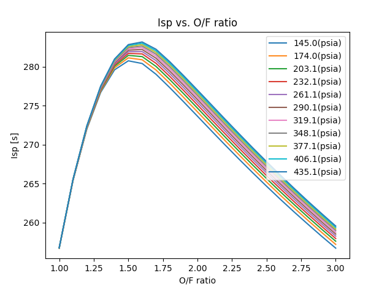

# plotCEA

## Setup Environment

```
$ python -m venv venv
$ source venv/bin/activate
$ pip install -r requirements.txt
``` 

## plotCEA Usage

```
$ python plotCEA.py <Your CEA output text file>
```




